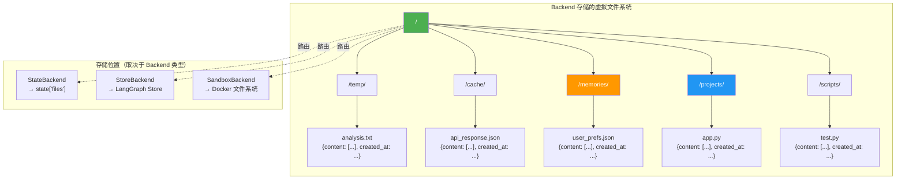

根据我对源码的深入分析，**Backend 主要存储的是"文件"（虚拟文件系统）**。

让我详细解释：

## Backend 存储的核心内容

### 1. **文件数据结构**

````python path=deepagents2/backends/protocol.py mode=EXCERPT
# Lines 95-101: 文件数据结构注释
# File data structure:
# {
#     "content": list[str],      # 文件内容（按行分割）
#     "created_at": str,         # 创建时间
#     "modified_at": str,        # 修改时间
# }
````

### 2. **具体存储内容**

Backend 存储的是一个**虚拟文件系统**，包含：

```python
# 文件内容示例
{
    "/app.py": {
        "content": ["import os", "def main():", "    pass"],
        "created_at": "2024-01-01T10:00:00",
        "modified_at": "2024-01-01T12:00:00"
    },
    "/data/config.json": {
        "content": ["{", '  "key": "value"', "}"],
        "created_at": "2024-01-01T11:00:00",
        "modified_at": "2024-01-01T11:00:00"
    },
    "/memories/user_preferences.txt": {
        "content": ["theme: dark", "language: zh-CN"],
        "created_at": "2024-01-01T09:00:00",
        "modified_at": "2024-01-01T13:00:00"
    }
}
```

---

## 不同 Backend 的存储位置

### 1. **StateBackend** - 存储在 Agent State 中

````python path=deepagents2/backends/state.py mode=EXCERPT
def write(self, file_path: str, content: str) -> WriteResult:
    # 存储到 state["files"] 字典中
    file_data = {
        "content": content.split("\n"),
        "created_at": datetime.now().isoformat(),
        "modified_at": datetime.now().isoformat(),
    }
    
    return WriteResult(
        path=file_path,
        files_update={file_path: file_data}  # 更新到 state["files"]
    )
````

**存储位置**：
```python
state = {
    "messages": [...],
    "files": {  # ← Backend 存储在这里
        "/app.py": {"content": [...], "created_at": "...", "modified_at": "..."},
        "/test.txt": {"content": [...], "created_at": "...", "modified_at": "..."}
    }
}
```

### 2. **StoreBackend** - 存储在 LangGraph Store 中

````python path=deepagents2/backends/store.py mode=EXCERPT
def write(self, file_path: str, content: str) -> WriteResult:
    file_data = {
        "content": content.split("\n"),
        "created_at": datetime.now().isoformat(),
    }
    
    # 存储到 LangGraph Store（外部持久化存储）
    self.store.put(
        namespace=self.namespace,  # 例如: ("filesystem",)
        key=file_path,             # 例如: "/memories/user.json"
        value=file_data
    )
````

**存储位置**：
```python
# LangGraph Store (例如 PostgreSQL)
namespace: ("filesystem",)
items: {
    "/memories/user.json": {"content": [...], "created_at": "..."},
    "/projects/app.py": {"content": [...], "created_at": "..."}
}
```

### 3. **SandboxBackend** - 存储在沙箱文件系统中

**存储位置**：Docker 容器或隔离环境的真实文件系统

```bash
# 在 Docker 容器内
/workspace/
  ├── app.py          # 真实文件
  ├── test.py         # 真实文件
  └── data/
      └── config.json # 真实文件
```

---

## Backend 存储的用途

### 1. **工作文件**（临时）
```python
# Agent 创建的临时文件
"/temp/analysis_result.txt"
"/cache/api_response.json"
"/workspace/test.py"
```

### 2. **长期记忆**（持久）
```python
# 用户偏好和历史数据
"/memories/user_preferences.json"
"/memories/conversation_history.txt"
"/memories/learned_facts.json"
```

### 3. **知识库**（持久）
```python
# 文档和数据
"/knowledge/api_docs.md"
"/knowledge/best_practices.txt"
"/projects/codebase_summary.json"
```

### 4. **代码文件**（可执行）
```python
# 需要执行的代码
"/scripts/test.py"
"/scripts/analyze.js"
"/scripts/build.sh"
```

---

## 可视化：Backend 存储的内容



---

## 实际示例

### 示例 1: Agent 创建分析报告

```python
# Agent 执行流程
1. 用户: "分析这段代码并生成报告"

2. Agent 调用: write_file("/analysis/report.md", "# 分析报告\n...")

3. Backend 存储:
   {
       "/analysis/report.md": {
           "content": ["# 分析报告", "## 问题", "- 问题1", "- 问题2"],
           "created_at": "2024-01-01T10:00:00",
           "modified_at": "2024-01-01T10:00:00"
       }
   }

4. 后续可以读取: read_file("/analysis/report.md")
```

### 示例 2: 保存用户偏好

```python
# 使用 StoreBackend 持久化
1. 用户: "记住我喜欢深色主题"

2. Agent 调用: write_file("/memories/preferences.json", '{"theme": "dark"}')

3. StoreBackend 存储到 LangGraph Store:
   namespace: ("filesystem",)
   key: "/memories/preferences.json"
   value: {
       "content": ['{"theme": "dark"}'],
       "created_at": "2024-01-01T10:00:00"
   }

4. 下次会话仍然可以读取（跨会话持久化）
```

### 示例 3: 执行代码

```python
# 使用 SandboxBackend
1. 用户: "创建并运行测试脚本"

2. Agent 调用: write_file("/test.py", "print('hello')")
   → SandboxBackend 在 Docker 容器中创建真实文件

3. Agent 调用: execute("python /test.py")
   → SandboxBackend 在容器中执行命令
   → 输出: "hello"
```

---

## 核心总结

### Backend 存储的是什么？

| 内容类型 | 数据结构 | 示例 |
|---------|---------|------|
| **文件路径** | 字符串 | `/app.py`, `/memories/user.json` |
| **文件内容** | 字符串列表（按行） | `["import os", "def main():", "    pass"]` |
| **元数据** | 时间戳 | `created_at`, `modified_at` |

### 为什么要存储文件？

1. **Agent 需要持久化工作成果**（分析报告、生成的代码）
2. **Agent 需要长期记忆**（用户偏好、历史数据）
3. **Agent 需要读写文件来完成任务**（读取配置、写入日志）
4. **Agent 需要执行代码**（创建脚本、运行测试）

### Backend 不存储什么？

- ❌ 对话消息（存储在 `state["messages"]`）
- ❌ Agent 的推理过程（由 LLM 处理）
- ❌ 工具调用记录（存储在消息历史中）
- ❌ Checkpointer 数据（由 LangGraph 管理）

**Backend 专注于文件系统的抽象和管理！** 🎯