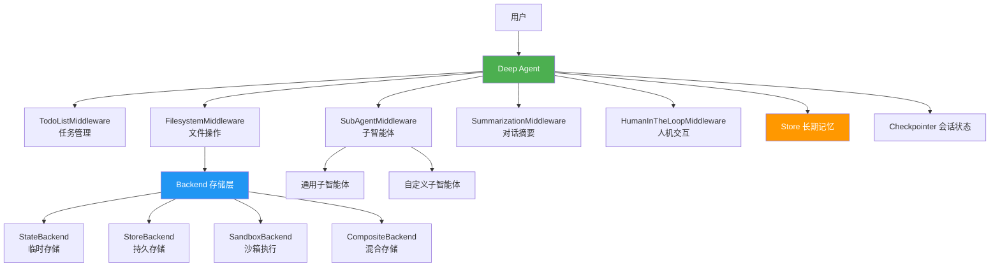
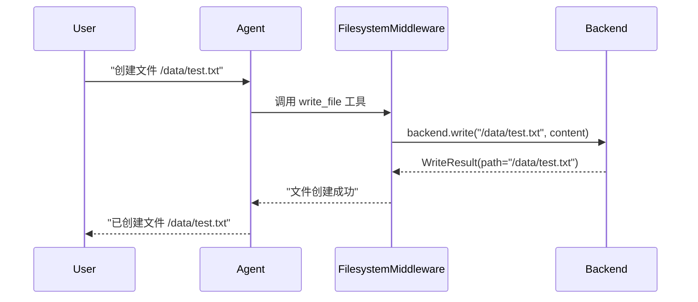
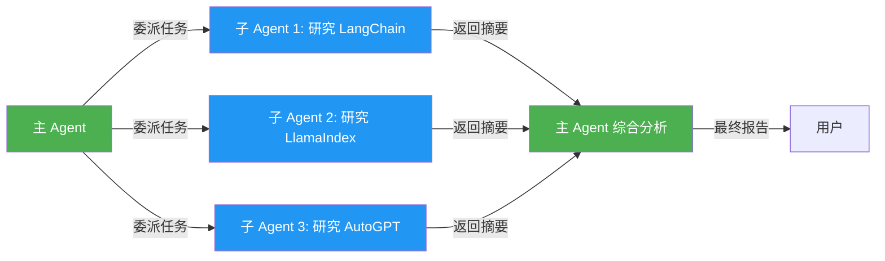
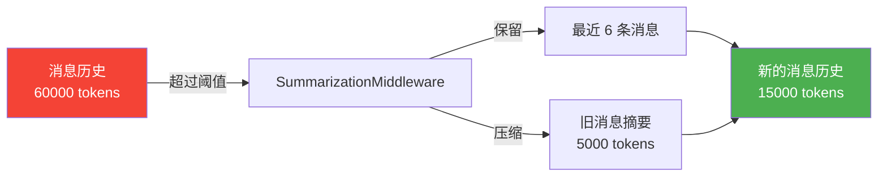
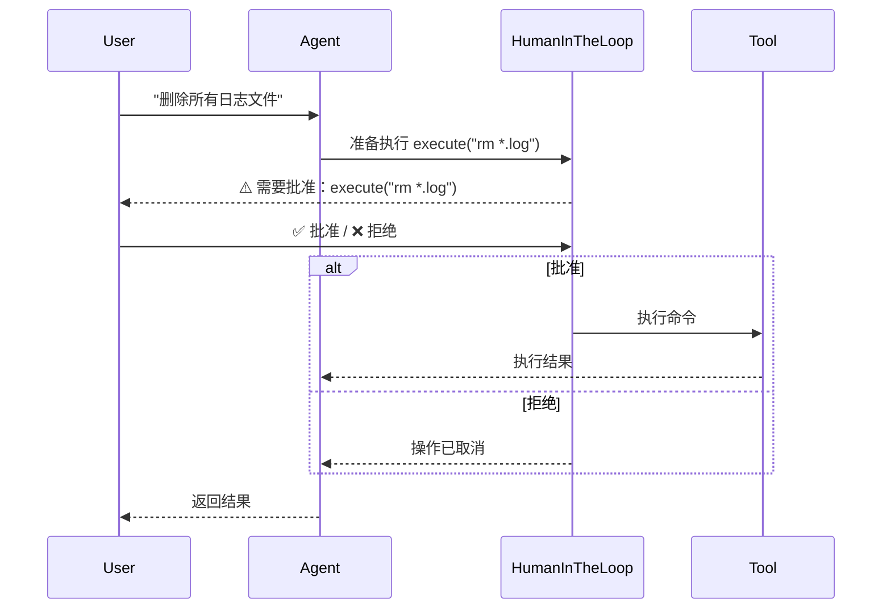
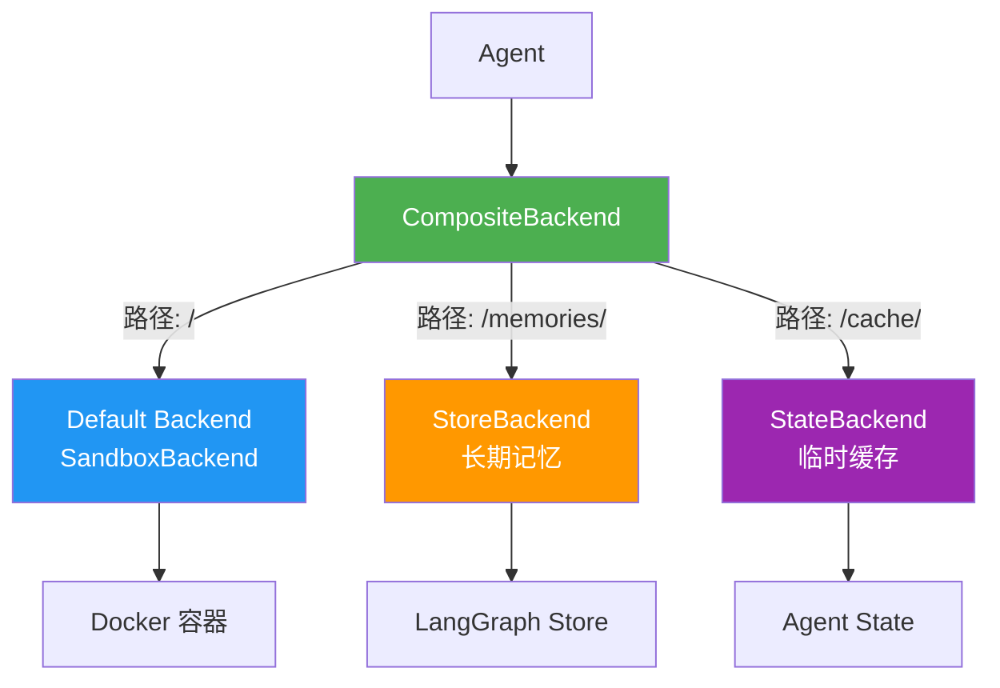
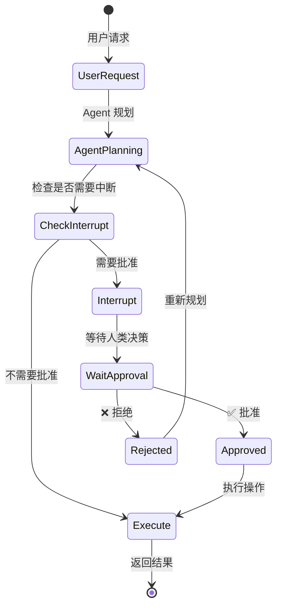

# DeepAgents 框架深度解析 🚀

> 一个基于 LangGraph 的企业级 AI Agent 框架，提供文件系统、子智能体、长期记忆等强大功能

## 📚 目录

1. [框架概览](#框架概览)
2. [核心概念](#核心概念)
3. [Middleware 中间件详解](#middleware-中间件详解)
4. [SubAgent 子智能体详解](#subagent-子智能体详解)
5. [Backend 后端存储详解](#backend-后端存储详解)
6. [Store 长期记忆详解](#store-长期记忆详解)
7. [Interrupt_on 人机交互详解](#interrupt_on-人机交互详解)
8. [完整应用案例](#完整应用案例)

---

## 框架概览

### 什么是 DeepAgents？

DeepAgents 是一个**企业级 AI Agent 框架**，它就像给 AI 装上了：
- 🗂️ **文件系统**：让 AI 能读写文件
- 🤖 **子智能体**：让 AI 能分配任务给专业助手
- 💾 **长期记忆**：让 AI 能记住跨会话的信息
- ⚙️ **命令执行**：让 AI 能运行 shell 命令
- 🔄 **人机协作**：让 AI 在关键操作前征求人类同意

### 框架架构图



---

## 核心概念

### create_deep_agent 函数签名

```python
def create_deep_agent(
    model: str | BaseChatModel | None = None,           # AI 模型
    tools: Sequence[BaseTool] | None = None,            # 工具列表
    system_prompt: str | None = None,                   # 系统提示词
    middleware: Sequence[AgentMiddleware] = (),         # 中间件列表
    subagents: list[SubAgent] | None = None,            # 子智能体列表
    store: BaseStore | None = None,                     # 长期记忆存储
    backend: BackendProtocol | None = None,             # 文件存储后端
    interrupt_on: dict[str, bool | InterruptOnConfig] | None = None,  # 人机交互配置
    checkpointer: Checkpointer | None = None,           # 会话检查点
    debug: bool = False,                                # 调试模式
) -> CompiledStateGraph:
    """创建一个深度智能体"""
```

### 默认内置功能

创建 Deep Agent 时，框架会**自动添加**以下中间件（按顺序）：

1. **TodoListMiddleware** - 任务列表管理
2. **FilesystemMiddleware** - 文件系统操作（ls, read_file, write_file, edit_file, glob, grep, execute）
3. **SubAgentMiddleware** - 子智能体调度（task 工具）
4. **SummarizationMiddleware** - 对话历史摘要（防止上下文溢出）
5. **AnthropicPromptCachingMiddleware** - 提示词缓存（节省成本）
6. **PatchToolCallsMiddleware** - 修复悬空工具调用
7. **HumanInTheLoopMiddleware** - 人机交互（如果配置了 interrupt_on）

---

## Middleware 中间件详解

### 什么是 Middleware？

Middleware（中间件）就像是**给 AI 加装的功能模块**，每个中间件负责一个特定功能。

### 1. FilesystemMiddleware - 文件系统中间件

#### 功能说明
让 AI 能够操作文件系统，提供 7 个核心工具：

| 工具 | 功能 | 示例 |
|------|------|------|
| `ls` | 列出目录文件 | `ls("/data/")` |
| `read_file` | 读取文件内容 | `read_file("/data/config.json")` |
| `write_file` | 创建新文件 | `write_file("/data/new.txt", "内容")` |
| `edit_file` | 编辑现有文件 | `edit_file("/data/config.json", "old", "new")` |
| `glob` | 模式匹配查找文件 | `glob("**/*.py")` |
| `grep` | 搜索文件内容 | `grep("TODO", glob="*.py")` |
| `execute` | 执行 shell 命令 | `execute("pytest tests/")` |

#### 代码示例

```python
from deepagents import create_deep_agent, FilesystemMiddleware
from deepagents.backends import StateBackend

# 示例 1: 使用默认配置（临时存储）
agent = create_deep_agent(
    system_prompt="你是一个文件管理助手"
)

# AI 可以执行的操作：
result = agent.invoke({
    "messages": [{"role": "user", "content": "创建一个 /data/test.txt 文件，内容是 'Hello World'"}]
})
# AI 会调用: write_file("/data/test.txt", "Hello World")

# 示例 2: 自定义 backend
agent = create_deep_agent(
    backend=lambda rt: StateBackend(rt),  # 使用工厂函数
    system_prompt="你是一个代码分析助手"
)

result = agent.invoke({
    "messages": [{"role": "user", "content": "找出所有 Python 文件中的 TODO 注释"}]
})
# AI 会调用: grep("TODO", glob="*.py", output_mode="content")
```

#### 工作原理图



### 2. SubAgentMiddleware - 子智能体中间件

#### 功能说明
让主 Agent 能够**委派任务**给专业的子 Agent，实现：
- 🎯 **任务隔离**：每个子任务有独立的上下文
- ⚡ **并行处理**：多个子 Agent 可以同时工作
- 💰 **节省 Token**：子任务完成后只返回摘要，不保留详细过程

#### 核心概念

```python
# 子智能体定义
SubAgent = {
    "name": "研究分析师",                    # 子智能体名称
    "description": "专门进行深度研究和分析",  # 用途描述（主 Agent 根据此决定是否调用）
    "system_prompt": "你是一个研究专家...",   # 子智能体的系统提示词
    "tools": [web_search, fetch_url],        # 子智能体可用的工具
    "model": "gpt-4",                        # 可选：使用不同的模型
    "middleware": [CustomMiddleware()],      # 可选：额外的中间件
}
```

#### 代码示例

```python
from deepagents import create_deep_agent

# 示例 1: 使用默认通用子智能体
agent = create_deep_agent(
    system_prompt="你是一个项目经理"
)

result = agent.invoke({
    "messages": [{
        "role": "user",
        "content": "研究 LangChain、LlamaIndex 和 AutoGPT 三个框架，并比较它们的优缺点"
    }]
})

# AI 会自动：
# 1. 启动 3 个并行的 task 子智能体
# 2. 每个子智能体独立研究一个框架
# 3. 收集所有子智能体的研究结果
# 4. 综合分析并返回比较报告

# 示例 2: 自定义专业子智能体
from langchain_core.tools import tool

@tool
def analyze_code(code: str) -> str:
    """分析代码质量"""
    return f"代码分析结果: {code}"

# 定义专业子智能体
code_reviewer = {
    "name": "code-reviewer",
    "description": "代码审查专家，用于审查代码质量、安全性和最佳实践",
    "system_prompt": """你是一个资深代码审查专家。
    审查代码时关注：
    1. 代码质量和可读性
    2. 安全漏洞
    3. 性能问题
    4. 最佳实践
    返回详细的审查报告。""",
    "tools": [analyze_code],
}

research_analyst = {
    "name": "research-analyst",
    "description": "研究分析专家，用于深度研究复杂主题",
    "system_prompt": "你是一个研究分析专家，擅长收集信息、分析数据并生成报告。",
    "tools": [],  # 使用默认工具
}

agent = create_deep_agent(
    subagents=[code_reviewer, research_analyst],
    system_prompt="你是一个智能助手，可以调用专业子智能体完成任务"
)

# 使用场景 1: 代码审查
result = agent.invoke({
    "messages": [{
        "role": "user",
        "content": "请审查 /src/main.py 文件的代码质量"
    }]
})
# AI 会：
# 1. 读取文件内容
# 2. 调用 code-reviewer 子智能体
# 3. 返回审查报告

# 使用场景 2: 研究任务
result = agent.invoke({
    "messages": [{
        "role": "user",
        "content": "研究量子计算的最新进展"
    }]
})
# AI 会调用 research-analyst 子智能体进行深度研究
```

#### 工作流程图



#### 何时使用子智能体？

✅ **应该使用**：
- 任务复杂且多步骤
- 任务可以独立完成
- 需要并行处理多个独立任务
- 需要隔离上下文（避免主线程被大量细节淹没）

❌ **不应该使用**：
- 简单的单步操作
- 需要看到中间推理过程
- 任务之间有强依赖关系

### 3. SummarizationMiddleware - 对话摘要中间件

#### 功能说明
当对话历史太长时，自动**压缩旧消息**，防止超出模型上下文限制。

```python
# 默认配置
SummarizationMiddleware(
    model=model,
    max_tokens_before_summary=50000,  # 超过 5 万 token 时触发摘要
    messages_to_keep=6,                # 保留最近 6 条消息不压缩
)
```

#### 工作原理



### 4. HumanInTheLoopMiddleware - 人机交互中间件

#### 功能说明
在 AI 执行**敏感操作**前，暂停并等待人类批准。

```python
from langchain.agents.middleware import InterruptOnConfig

agent = create_deep_agent(
    interrupt_on={
        "execute": True,  # 执行命令前需要批准
        "write_file": InterruptOnConfig(
            interrupt_before=True,   # 执行前中断
            interrupt_after=False,   # 执行后不中断
        ),
        "edit_file": True,
    }
)
```

#### 交互流程



---

## Backend 后端存储详解

### Backend 是什么？

Backend 决定了**文件存储在哪里**，就像给 AI 配置不同的"硬盘"。

### Backend 类型对比

| Backend 类型 | 存储位置 | 持久化 | 跨会话 | 执行命令 | 适用场景 |
|-------------|---------|--------|--------|---------|---------|
| **StateBackend** | Agent 状态 | ✅ (Checkpointer) | ❌ | ❌ | 临时文件、单会话 |
| **StoreBackend** | LangGraph Store | ✅ | ✅ | ❌ | 长期记忆、跨会话 |
| **SandboxBackend** | 沙箱环境 | ✅ | ✅ | ✅ | 代码执行、测试 |
| **CompositeBackend** | 混合存储 | ✅ | ✅ | ✅ | 企业级应用 |

### 1. StateBackend - 临时存储

#### 特点
- 文件存储在 **Agent 的状态**中
- 通过 Checkpointer 持久化
- **不跨会话**：每个对话线程独立
- **不支持命令执行**

#### 代码示例

```python
from deepagents import create_deep_agent
from deepagents.backends import StateBackend

# 方式 1: 使用默认配置（自动使用 StateBackend）
agent = create_deep_agent()

# 方式 2: 显式指定 StateBackend
agent = create_deep_agent(
    backend=lambda rt: StateBackend(rt)  # 使用工厂函数
)

# 使用示例
result = agent.invoke({
    "messages": [{"role": "user", "content": "创建文件 /notes.txt，内容是 'Hello'"}]
})

# 文件存储在 state["files"] 中：
# state = {
#     "files": {
#         "/notes.txt": {
#             "content": ["Hello"],
#             "created_at": "2024-01-01T00:00:00",
#             "modified_at": "2024-01-01T00:00:00"
#         }
#     }
# }
```

### 2. StoreBackend - 持久存储

#### 特点
- 文件存储在 **LangGraph Store**
- **跨会话持久化**：所有对话共享
- 支持命名空间隔离
- **不支持命令执行**

#### 代码示例

```python
from deepagents import create_deep_agent
from deepagents.backends import StoreBackend
from langgraph.store.memory import InMemoryStore

# 创建 Store
store = InMemoryStore()

# 创建 Agent
agent = create_deep_agent(
    backend=lambda rt: StoreBackend(rt),
    store=store,  # 必须提供 store
)

# 会话 1: 创建文件
result1 = agent.invoke(
    {"messages": [{"role": "user", "content": "创建 /memories/user_prefs.json"}]},
    config={"configurable": {"thread_id": "thread-1"}}
)

# 会话 2: 读取文件（不同线程，但能访问相同文件）
result2 = agent.invoke(
    {"messages": [{"role": "user", "content": "读取 /memories/user_prefs.json"}]},
    config={"configurable": {"thread_id": "thread-2"}}  # 不同线程
)
# ✅ 能够读取到会话 1 创建的文件
```

### 3. SandboxBackend - 沙箱执行

#### 特点
- 文件存储在**隔离的沙箱环境**（如 Docker 容器）
- **支持命令执行**（execute 工具）
- 安全隔离
- 适合代码执行、测试

#### 代码示例

```python
from deepagents import create_deep_agent
from deepagents.backends.sandbox import BaseSandbox
from deepagents.backends.protocol import ExecuteResponse

# 自定义沙箱实现
class DockerSandbox(BaseSandbox):
    def __init__(self, container_id: str):
        self.container_id = container_id

    def execute(self, command: str) -> ExecuteResponse:
        """在 Docker 容器中执行命令"""
        import subprocess
        result = subprocess.run(
            ["docker", "exec", self.container_id, "sh", "-c", command],
            capture_output=True,
            text=True
        )
        return ExecuteResponse(
            output=result.stdout + result.stderr,
            exit_code=result.returncode
        )

    @property
    def id(self) -> str:
        return self.container_id

# 创建 Agent
sandbox = DockerSandbox(container_id="my-sandbox")
agent = create_deep_agent(
    backend=sandbox,
    system_prompt="你是一个代码执行助手"
)

# 使用示例
result = agent.invoke({
    "messages": [{
        "role": "user",
        "content": "创建一个 Python 脚本 test.py，然后运行它"
    }]
})

# AI 会：
# 1. write_file("/test.py", "print('Hello')")
# 2. execute("python /test.py")
# 3. 返回执行结果
```

### 4. CompositeBackend - 混合存储（企业级）

#### 特点
- **路由机制**：根据路径前缀选择不同的 Backend
- 组合多个 Backend 的优势
- 最灵活、最强大

#### 架构图



#### 代码示例

```python
from deepagents import create_deep_agent
from deepagents.backends import StateBackend, StoreBackend, CompositeBackend
from langgraph.store.memory import InMemoryStore

# 创建 Store
store = InMemoryStore()

# 创建混合 Backend
composite_backend = CompositeBackend(
    default=DockerSandbox(container_id="my-sandbox"),  # 默认使用沙箱
    routes={
        "/memories/": lambda rt: StoreBackend(rt),     # /memories/ 路径使用持久存储
        "/cache/": lambda rt: StateBackend(rt),        # /cache/ 路径使用临时存储
    }
)

# 创建 Agent
agent = create_deep_agent(
    backend=composite_backend,
    store=store,
    system_prompt="你是一个智能助手"
)

# 使用示例
result = agent.invoke({
    "messages": [{
        "role": "user",
        "content": """
        1. 在 /test.py 创建测试脚本（存储在沙箱）
        2. 在 /memories/user_prefs.json 保存用户偏好（持久存储）
        3. 在 /cache/temp.txt 创建临时文件（临时存储）
        """
    }]
})

# 文件路由：
# /test.py          -> DockerSandbox（可执行）
# /memories/...     -> StoreBackend（跨会话持久化）
# /cache/...        -> StateBackend（会话内临时）
```

#### 路由规则

```python
# 路径匹配规则（最长前缀优先）
"/memories/notes.txt"     -> StoreBackend   # 匹配 /memories/
"/cache/temp.txt"         -> StateBackend   # 匹配 /cache/
"/test.py"                -> DockerSandbox  # 不匹配任何路由，使用 default
"/memories/deep/file.txt" -> StoreBackend   # 匹配 /memories/（支持嵌套）
```

---

## Store 长期记忆详解

### Store 是什么？

Store 是 LangGraph 提供的**跨会话持久化存储**，用于保存需要长期记住的信息。

### Store vs Backend 的区别

| 特性 | Store | Backend |
|------|-------|---------|
| **用途** | 存储结构化数据（记忆、偏好） | 存储文件内容 |
| **访问方式** | 通过 namespace + key | 通过文件路径 |
| **跨会话** | ✅ 所有会话共享 | 取决于 Backend 类型 |
| **典型用例** | 用户偏好、历史记录 | 文档、代码文件 |

### 代码示例

```python
from deepagents import create_deep_agent
from deepagents.backends import StoreBackend, CompositeBackend, StateBackend
from langgraph.store.memory import InMemoryStore

# 创建 Store
store = InMemoryStore()

# 方式 1: 仅使用 Store（通过 StoreBackend）
agent = create_deep_agent(
    backend=lambda rt: StoreBackend(rt),
    store=store,
)

# 方式 2: 混合使用（推荐）
composite_backend = CompositeBackend(
    default=lambda rt: StateBackend(rt),      # 临时文件
    routes={
        "/memories/": lambda rt: StoreBackend(rt),  # 长期记忆
    }
)

agent = create_deep_agent(
    backend=composite_backend,
    store=store,
)

# 使用示例：保存用户偏好
result = agent.invoke({
    "messages": [{
        "role": "user",
        "content": "记住我的偏好：我喜欢简洁的代码风格，使用 4 空格缩进"
    }]
})

# AI 会创建文件：
# write_file("/memories/user_prefs.json", '{"code_style": "简洁", "indent": 4}')

# 下次对话（不同会话）
result = agent.invoke({
    "messages": [{
        "role": "user",
        "content": "帮我写一个 Python 函数"
    }],
    config={"configurable": {"thread_id": "new-thread"}}
})

# AI 会：
# 1. read_file("/memories/user_prefs.json")  # 读取偏好
# 2. 根据偏好生成代码（4 空格缩进）
```

### Store 的命名空间

```python
# StoreBackend 自动使用命名空间
# 格式: (assistant_id, "filesystem") 或 ("filesystem",)

# 如果配置中有 assistant_id
config = {
    "metadata": {"assistant_id": "assistant-123"}
}

# 文件会存储在：
# namespace = ("assistant-123", "filesystem")
# key = "/memories/user_prefs.json"

# 这样不同 assistant 的文件互不干扰
```

---

## Interrupt_on 人机交互详解

### 什么是 Interrupt_on？

Interrupt_on 让你能够**控制 AI 在执行哪些操作前需要人类批准**，防止 AI 执行危险操作。

### 配置方式

```python
from langchain.agents.middleware import InterruptOnConfig

# 方式 1: 简单配置（布尔值）
interrupt_on = {
    "execute": True,      # 执行命令前中断
    "write_file": True,   # 写文件前中断
    "edit_file": True,    # 编辑文件前中断
}

# 方式 2: 详细配置
interrupt_on = {
    "execute": InterruptOnConfig(
        interrupt_before=True,   # 执行前中断
        interrupt_after=False,   # 执行后不中断
    ),
    "write_file": InterruptOnConfig(
        interrupt_before=True,
        interrupt_after=True,    # 执行后也中断（查看结果）
    ),
}

agent = create_deep_agent(
    interrupt_on=interrupt_on
)
```

### 实际应用示例

```python
from deepagents import create_deep_agent
from langgraph.checkpoint.memory import MemorySaver

# 创建带人机交互的 Agent
checkpointer = MemorySaver()

agent = create_deep_agent(
    checkpointer=checkpointer,
    interrupt_on={
        "execute": True,
        "write_file": True,
        "edit_file": True,
    }
)

# 配置
config = {"configurable": {"thread_id": "thread-1"}}

# 第一步：用户请求
result = agent.invoke({
    "messages": [{"role": "user", "content": "删除所有 .log 文件"}]
}, config=config)

# Agent 会中断，等待批准
# result 包含待执行的操作信息

# 查看待批准的操作
print(result)
# 输出: 准备执行 execute("rm *.log")

# 第二步：人类批准
# 方式 1: 批准
result = agent.invoke(None, config=config)  # 继续执行

# 方式 2: 拒绝（修改状态）
# 需要手动修改 checkpointer 中的状态来拒绝操作
```

### 中断流程图



---

## 完整应用案例

### 案例 1: 基础文件管理助手

**需求**：创建一个能够管理文件的 AI 助手

```python
from deepagents import create_deep_agent

# 创建最简单的 Agent
agent = create_deep_agent(
    system_prompt="你是一个文件管理助手，帮助用户管理文件"
)

# 使用示例
result = agent.invoke({
    "messages": [{
        "role": "user",
        "content": "创建一个项目结构：包含 src/, tests/, docs/ 三个目录"
    }]
})

# AI 会自动：
# 1. write_file("/src/.gitkeep", "")
# 2. write_file("/tests/.gitkeep", "")
# 3. write_file("/docs/.gitkeep", "")
```

### 案例 2: 代码分析助手（带子智能体）

**需求**：分析代码库，生成文档，审查代码质量

```python
from deepagents import create_deep_agent
from langchain_core.tools import tool

# 定义自定义工具
@tool
def run_linter(file_path: str) -> str:
    """运行代码检查工具"""
    return f"Linting {file_path}..."

# 定义专业子智能体
code_reviewer = {
    "name": "code-reviewer",
    "description": "代码审查专家，在完成代码编写后自动审查代码质量",
    "system_prompt": """你是一个代码审查专家。
    审查代码时关注：
    1. 代码风格和规范
    2. 潜在的 bug
    3. 性能问题
    4. 安全漏洞

    返回详细的审查报告，包括：
    - 发现的问题
    - 严重程度（高/中/低）
    - 修改建议
    """,
    "tools": [run_linter],
}

doc_generator = {
    "name": "doc-generator",
    "description": "文档生成专家，为代码生成详细的文档",
    "system_prompt": """你是一个技术文档专家。
    生成的文档应包括：
    1. API 文档
    2. 使用示例
    3. 架构说明
    4. 最佳实践

    使用 Markdown 格式，清晰易读。
    """,
    "tools": [],
}

# 创建 Agent
agent = create_deep_agent(
    subagents=[code_reviewer, doc_generator],
    system_prompt="""你是一个代码分析助手。

    工作流程：
    1. 分析代码库结构
    2. 调用 code-reviewer 审查代码
    3. 调用 doc-generator 生成文档
    4. 汇总结果并提供改进建议
    """
)

# 使用示例
result = agent.invoke({
    "messages": [{
        "role": "user",
        "content": "分析 /src 目录下的所有 Python 代码，生成审查报告和文档"
    }]
})

# AI 执行流程：
# 1. glob("**/*.py", path="/src")  # 找到所有 Python 文件
# 2. 并行启动多个 code-reviewer 子智能体审查不同文件
# 3. 启动 doc-generator 子智能体生成文档
# 4. 汇总所有结果
# 5. 返回综合报告
```

### 案例 3: 性能测试助手（完整企业级应用）

**需求**：自动化性能测试流程，包括脚本生成、执行、报告生成

```python
from deepagents import create_deep_agent
from deepagents.backends import StateBackend, StoreBackend, CompositeBackend
from langgraph.store.memory import InMemoryStore
from langgraph.checkpoint.memory import MemorySaver
from langchain_core.tools import tool

# 1. 定义自定义工具
@tool
def generate_k6_script(scenario: dict) -> str:
    """生成 K6 性能测试脚本"""
    # 实际实现省略
    return f"Generated K6 script for {scenario['name']}"

@tool
def execute_k6_test(script_path: str) -> dict:
    """执行 K6 测试"""
    # 实际实现省略
    return {"status": "success", "metrics": {...}}

@tool
def generate_report(results: dict) -> str:
    """生成性能测试报告"""
    # 实际实现省略
    return "report.html"

# 2. 定义子智能体
script_generator = {
    "name": "script-generator",
    "description": "K6 脚本生成专家，根据测试需求生成性能测试脚本",
    "system_prompt": """你是 K6 性能测试脚本生成专家。

    根据用户提供的 API 信息生成 K6 测试脚本，包括：
    1. HTTP 请求配置
    2. 虚拟用户配置
    3. 测试场景设置
    4. 性能指标阈值

    生成的脚本应该遵循 K6 最佳实践。
    """,
    "tools": [generate_k6_script],
}

test_executor = {
    "name": "test-executor",
    "description": "测试执行专家，执行性能测试并收集结果",
    "system_prompt": """你是性能测试执行专家。

    职责：
    1. 执行 K6 测试脚本
    2. 监控测试过程
    3. 收集性能指标
    4. 检测异常情况

    如果测试失败，分析原因并提供建议。
    """,
    "tools": [execute_k6_test],
}

report_analyst = {
    "name": "report-analyst",
    "description": "报告分析专家，分析测试结果并生成详细报告",
    "system_prompt": """你是性能测试报告分析专家。

    分析测试结果并生成报告，包括：
    1. 性能指标摘要
    2. 瓶颈分析
    3. 趋势分析
    4. 优化建议

    报告应该清晰、专业，便于技术和非技术人员理解。
    """,
    "tools": [generate_report],
}

# 3. 配置存储
store = InMemoryStore()
checkpointer = MemorySaver()

# 4. 配置混合 Backend
composite_backend = CompositeBackend(
    default=lambda rt: StateBackend(rt),  # 临时文件（测试脚本、结果）
    routes={
        "/memories/": lambda rt: StoreBackend(rt),  # 长期记忆（历史测试数据）
    }
)

# 5. 创建 Agent
agent = create_deep_agent(
    tools=[],  # 主 Agent 不需要额外工具
    subagents=[script_generator, test_executor, report_analyst],
    backend=composite_backend,
    store=store,
    checkpointer=checkpointer,
    interrupt_on={
        "execute_k6_test": True,  # 执行测试前需要批准
    },
    system_prompt="""你是一个性能测试编排助手。

    工作流程：
    1. 理解用户的测试需求
    2. 调用 script-generator 生成测试脚本
    3. 调用 test-executor 执行测试（需要人类批准）
    4. 调用 report-analyst 分析结果并生成报告
    5. 将测试结果保存到 /memories/ 用于历史对比

    始终保持专业、高效，提供清晰的进度反馈。
    """
)

# 6. 使用示例
config = {"configurable": {"thread_id": "test-session-1"}}

# 第一步：提交测试需求
result = agent.invoke({
    "messages": [{
        "role": "user",
        "content": """
        为以下 API 创建性能测试：
        - GET https://api.example.com/users
        - POST https://api.example.com/users

        测试要求：
        - 100 并发用户
        - 持续 5 分钟
        - 响应时间 < 200ms
        """
    }]
}, config=config)

# AI 执行流程：
# 1. 调用 script-generator 子智能体
#    - 生成 K6 脚本
#    - 保存到 /scripts/test_001.js
#
# 2. 准备执行测试（中断，等待批准）
#    - 显示测试配置
#    - 等待用户确认
#
# 3. 用户批准后，调用 test-executor 子智能体
#    - 执行 K6 测试
#    - 收集结果
#
# 4. 调用 report-analyst 子智能体
#    - 分析测试结果
#    - 生成 HTML 报告
#    - 保存到 /reports/test_001.html
#
# 5. 保存历史数据
#    - write_file("/memories/test_history.json", ...)
#
# 6. 返回综合报告

# 第二步：批准执行（如果配置了 interrupt_on）
result = agent.invoke(None, config=config)

# 第三步：查看历史测试（跨会话）
result = agent.invoke({
    "messages": [{
        "role": "user",
        "content": "对比本次测试和上次测试的性能差异"
    }]
}, config={"configurable": {"thread_id": "new-session"}})

# AI 会：
# 1. read_file("/memories/test_history.json")  # 读取历史数据
# 2. 对比分析
# 3. 生成对比报告
```

### 案例 4: 智能研究助手（并行子智能体）

**需求**：研究多个主题并生成综合报告

```python
from deepagents import create_deep_agent

agent = create_deep_agent(
    system_prompt="""你是一个研究助手。

    当需要研究多个独立主题时：
    1. 为每个主题启动一个独立的 task 子智能体
    2. 并行执行所有研究任务
    3. 收集所有结果
    4. 综合分析并生成报告
    """
)

# 使用示例
result = agent.invoke({
    "messages": [{
        "role": "user",
        "content": """
        研究以下三个 AI 框架并比较：
        1. LangChain
        2. LlamaIndex
        3. AutoGPT

        对比维度：
        - 核心功能
        - 优缺点
        - 适用场景
        - 社区活跃度
        """
    }]
})

# AI 执行流程：
# 1. 启动 3 个并行的 general-purpose 子智能体
#    - 子智能体 1: 研究 LangChain
#    - 子智能体 2: 研究 LlamaIndex
#    - 子智能体 3: 研究 AutoGPT
#
# 2. 每个子智能体独立工作：
#    - 搜索相关信息
#    - 阅读文档
#    - 分析特性
#    - 生成摘要报告
#
# 3. 主 Agent 收集所有子智能体的报告
#
# 4. 综合分析：
#    - 对比三个框架
#    - 生成对比表格
#    - 提供选择建议
#
# 5. 返回最终报告
```

### 案例 5: 企业级应用（所有功能组合）

**需求**：构建一个完整的企业级 AI 助手

```python
from deepagents import create_deep_agent
from deepagents.backends import StateBackend, StoreBackend, CompositeBackend
from langgraph.store.memory import InMemoryStore
from langgraph.checkpoint.memory import MemorySaver
from langchain_anthropic import ChatAnthropic
from langchain.agents.middleware import InterruptOnConfig

# 1. 配置模型
model = ChatAnthropic(
    model="claude-sonnet-4-20250514",
    temperature=0,
)

# 2. 配置存储
store = InMemoryStore()
checkpointer = MemorySaver()

# 3. 配置混合 Backend
composite_backend = CompositeBackend(
    default=lambda rt: StateBackend(rt),  # 默认临时存储
    routes={
        "/memories/": lambda rt: StoreBackend(rt),      # 长期记忆
        "/projects/": lambda rt: StoreBackend(rt),      # 项目文件
        "/cache/": lambda rt: StateBackend(rt),         # 缓存
    }
)

# 4. 定义子智能体
subagents = [
    {
        "name": "code-reviewer",
        "description": "代码审查专家，审查代码质量和安全性",
        "system_prompt": "你是代码审查专家...",
        "tools": [],
    },
    {
        "name": "doc-writer",
        "description": "技术文档编写专家",
        "system_prompt": "你是技术文档专家...",
        "tools": [],
    },
    {
        "name": "test-engineer",
        "description": "测试工程师，编写和执行测试",
        "system_prompt": "你是测试工程师...",
        "tools": [],
    },
]

# 5. 配置人机交互
interrupt_on = {
    "execute": InterruptOnConfig(
        interrupt_before=True,   # 执行命令前需要批准
        interrupt_after=False,
    ),
    "write_file": InterruptOnConfig(
        interrupt_before=True,   # 写文件前需要批准
        interrupt_after=False,
    ),
    "edit_file": True,           # 编辑文件前需要批准
    "task": InterruptOnConfig(
        interrupt_before=False,  # 启动子智能体不需要批准
        interrupt_after=True,    # 子智能体完成后显示结果
    ),
}

# 6. 创建 Agent
agent = create_deep_agent(
    model=model,
    tools=[],  # 可以添加自定义工具
    subagents=subagents,
    backend=composite_backend,
    store=store,
    checkpointer=checkpointer,
    interrupt_on=interrupt_on,
    debug=True,  # 开启调试模式
    system_prompt="""你是一个企业级 AI 助手。

    核心能力：
    1. 文件管理：读写编辑文件
    2. 代码分析：审查代码质量
    3. 文档生成：自动生成技术文档
    4. 测试执行：编写和运行测试
    5. 长期记忆：记住用户偏好和历史信息

    工作原则：
    1. 安全第一：敏感操作前征求批准
    2. 质量优先：代码完成后自动审查
    3. 文档完善：重要功能自动生成文档
    4. 测试覆盖：关键代码自动编写测试

    文件组织：
    - /projects/：项目文件（持久化）
    - /memories/：用户偏好和历史（持久化）
    - /cache/：临时文件（会话内）
    - 其他：临时工作文件
    """
)

# 7. 使用示例
config = {"configurable": {"thread_id": "enterprise-session-1"}}

# 场景 1: 创建新项目
result = agent.invoke({
    "messages": [{
        "role": "user",
        "content": """
        创建一个新的 Python 项目 'user-service'，包括：
        1. 基础项目结构
        2. 用户管理 API
        3. 单元测试
        4. API 文档

        我的偏好：
        - 使用 FastAPI 框架
        - 代码风格：Black + isort
        - 测试框架：pytest
        """
    }]
}, config=config)

# AI 执行流程：
#
# 1. 保存用户偏好到长期记忆
#    write_file("/memories/user_prefs.json", {...})
#
# 2. 创建项目结构
#    write_file("/projects/user-service/main.py", ...)
#    write_file("/projects/user-service/requirements.txt", ...)
#    write_file("/projects/user-service/tests/test_main.py", ...)
#    （每个 write_file 都会触发人机交互，等待批准）
#
# 3. 启动 code-reviewer 子智能体审查代码
#    task("审查 /projects/user-service/ 的代码质量", "code-reviewer")
#    （完成后显示审查结果）
#
# 4. 启动 doc-writer 子智能体生成文档
#    task("为 /projects/user-service/ 生成 API 文档", "doc-writer")
#
# 5. 启动 test-engineer 子智能体编写测试
#    task("为 /projects/user-service/ 编写单元测试", "test-engineer")
#
# 6. 汇总结果并返回

# 场景 2: 跨会话使用（记住偏好）
result = agent.invoke({
    "messages": [{
        "role": "user",
        "content": "帮我写一个数据验证函数"
    }]
}, config={"configurable": {"thread_id": "new-session"}})

# AI 会：
# 1. read_file("/memories/user_prefs.json")  # 读取之前保存的偏好
# 2. 根据偏好（Black 风格）生成代码
# 3. 自动调用 code-reviewer 审查
# 4. 返回结果

# 场景 3: 查看项目历史
result = agent.invoke({
    "messages": [{
        "role": "user",
        "content": "列出我创建的所有项目"
    }]
}, config=config)

# AI 会：
# 1. ls("/projects/")  # 列出所有项目
# 2. 读取每个项目的 README
# 3. 生成项目列表和摘要
```

---

## 最佳实践总结

### 1. Backend 选择指南

```python
# 场景 1: 简单应用，单会话
agent = create_deep_agent()  # 默认 StateBackend

# 场景 2: 需要跨会话记忆
agent = create_deep_agent(
    backend=lambda rt: StoreBackend(rt),
    store=InMemoryStore()
)

# 场景 3: 需要执行代码
agent = create_deep_agent(
    backend=DockerSandbox(...)
)

# 场景 4: 企业级应用（推荐）
agent = create_deep_agent(
    backend=CompositeBackend(
        default=SandboxBackend(...),  # 代码执行
        routes={
            "/memories/": StoreBackend,  # 长期记忆
            "/cache/": StateBackend,     # 临时缓存
        }
    ),
    store=InMemoryStore()
)
```

### 2. 子智能体使用指南

```python
# ✅ 好的使用场景
# 1. 并行独立任务
"研究 A、B、C 三个主题" -> 启动 3 个并行子智能体

# 2. 复杂多步骤任务
"分析代码库并生成报告" -> 启动子智能体隔离上下文

# 3. 专业领域任务
"审查代码质量" -> 调用 code-reviewer 子智能体

# ❌ 不好的使用场景
# 1. 简单单步操作
"创建一个文件" -> 直接调用 write_file，不需要子智能体

# 2. 需要看中间过程
"一步步教我如何..." -> 不要用子智能体（会隐藏过程）
```

### 3. 人机交互配置指南

```python
# 开发环境：宽松配置
interrupt_on = {
    "execute": True,  # 只拦截命令执行
}

# 生产环境：严格配置
interrupt_on = {
    "execute": True,
    "write_file": True,
    "edit_file": True,
    "task": InterruptOnConfig(
        interrupt_before=False,
        interrupt_after=True,  # 查看子智能体结果
    ),
}
```

### 4. 性能优化建议

```python
# 1. 使用 Prompt Caching（自动启用）
# AnthropicPromptCachingMiddleware 会自动缓存系统提示词

# 2. 配置合理的摘要阈值
SummarizationMiddleware(
    max_tokens_before_summary=50000,  # 根据模型调整
    messages_to_keep=6,
)

# 3. 并行执行子智能体
# 框架会自动并行执行多个 task 调用

# 4. 使用 CompositeBackend 优化存储
# 临时文件用 StateBackend，持久文件用 StoreBackend
```

---

## 常见问题 FAQ

### Q1: StateBackend 和 StoreBackend 的区别？

**A**:
- **StateBackend**: 文件存储在 Agent 状态中，通过 Checkpointer 持久化，**不跨会话**
- **StoreBackend**: 文件存储在 LangGraph Store 中，**跨会话共享**

```python
# StateBackend: 每个会话独立
agent = create_deep_agent(backend=lambda rt: StateBackend(rt))

# 会话 1 创建的文件，会话 2 看不到
result1 = agent.invoke(..., config={"thread_id": "1"})
result2 = agent.invoke(..., config={"thread_id": "2"})  # 看不到会话 1 的文件

# StoreBackend: 所有会话共享
agent = create_deep_agent(
    backend=lambda rt: StoreBackend(rt),
    store=InMemoryStore()
)

# 会话 1 创建的文件，会话 2 能看到
result1 = agent.invoke(..., config={"thread_id": "1"})
result2 = agent.invoke(..., config={"thread_id": "2"})  # 能看到会话 1 的文件
```

### Q2: 如何让子智能体使用不同的模型？

**A**:
```python
subagents = [
    {
        "name": "fast-agent",
        "description": "快速响应的助手",
        "system_prompt": "...",
        "model": "gpt-3.5-turbo",  # 使用更快的模型
    },
    {
        "name": "smart-agent",
        "description": "深度分析的助手",
        "system_prompt": "...",
        "model": "gpt-4",  # 使用更强的模型
    },
]

agent = create_deep_agent(subagents=subagents)
```

### Q3: 如何禁用某些默认工具？

**A**: 目前框架会自动添加所有文件工具，如果需要禁用，可以通过自定义 Middleware：

```python
from deepagents.middleware import FilesystemMiddleware

# 创建自定义 FilesystemMiddleware（不包含某些工具）
# 需要修改源码或等待框架支持
```

### Q4: 如何查看 Agent 的执行过程？

**A**:
```python
# 方式 1: 开启 debug 模式
agent = create_deep_agent(debug=True)

# 方式 2: 使用 LangSmith 追踪
import os
os.environ["LANGCHAIN_TRACING_V2"] = "true"
os.environ["LANGCHAIN_API_KEY"] = "your-api-key"

# 方式 3: 流式输出
for chunk in agent.stream({...}):
    print(chunk)
```

### Q5: 如何处理大文件？

**A**:
```python
# FilesystemMiddleware 自动处理大文件
# 1. 读取文件时使用分页
result = agent.invoke({
    "messages": [{
        "role": "user",
        "content": "读取 /large_file.txt 的前 100 行"
    }]
})
# AI 会调用: read_file("/large_file.txt", offset=0, limit=100)

# 2. 工具结果太大时自动保存到文件
# 如果工具返回超过 20000 tokens，会自动保存到 /large_tool_results/
```

---

## 总结

DeepAgents 框架提供了一套完整的企业级 AI Agent 解决方案：

### 核心优势

1. **🗂️ 强大的文件系统**
   - 7 个文件操作工具
   - 灵活的存储后端
   - 自动处理大文件

2. **🤖 智能的子智能体系统**
   - 任务隔离和并行处理
   - 节省 Token 和成本
   - 支持专业领域定制

3. **💾 完善的存储方案**
   - 临时存储（StateBackend）
   - 持久存储（StoreBackend）
   - 沙箱执行（SandboxBackend）
   - 混合存储（CompositeBackend）

4. **🔄 安全的人机协作**
   - 灵活的中断配置
   - 操作前后都可中断
   - 保护敏感操作

5. **⚡ 性能优化**
   - 自动对话摘要
   - Prompt 缓存
   - 并行执行

### 适用场景

- ✅ 代码分析和生成
- ✅ 文档自动化
- ✅ 测试自动化
- ✅ 研究和分析
- ✅ 项目管理
- ✅ 企业级应用

### 快速开始

```python
from deepagents import create_deep_agent

# 最简单的开始
agent = create_deep_agent(
    system_prompt="你是一个智能助手"
)

result = agent.invoke({
    "messages": [{"role": "user", "content": "你好"}]
})
```

---

## 参考资源

- 📖 [LangGraph 文档](https://langchain-ai.github.io/langgraph/)
- 📖 [LangChain 文档](https://python.langchain.com/)
- 💻 [DeepAgents 源码](https://github.com/langchain-ai/deepagents)
- 🎓 [示例代码](./examples/)

---

**Happy Coding! 🚀**
