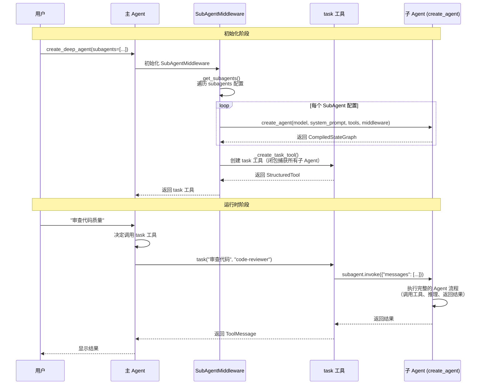
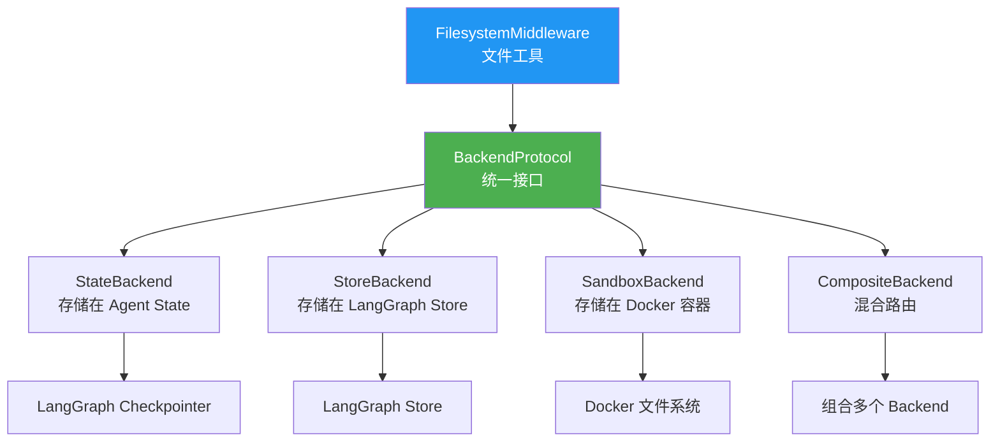

# SubAgent 和 Backend 本质深度解析 🔍

## 问题 1: 子智能体的本质是什么？

### 答案：是的！子智能体本质上就是通过 `create_agent` 创建的独立 Agent

让我们看源码证明：

<augment_code_snippet path="deepagents2/middleware/subagents.py" mode="EXCERPT">
````python
# 第 244 行：创建通用子智能体
general_purpose_subagent = create_agent(
    default_model,
    system_prompt=DEFAULT_SUBAGENT_PROMPT,
    tools=default_tools,
    middleware=general_purpose_middleware,
)

# 第 270 行：创建自定义子智能体
agents[agent_["name"]] = create_agent(
    subagent_model,
    system_prompt=agent_["system_prompt"],
    tools=_tools,
    middleware=_middleware,
)
````
</augment_code_snippet>

### 深度解析

#### 1. SubAgent 的定义只是"配方"

```python
# 你定义的 SubAgent 只是一个配置字典（TypedDict）
code_reviewer = {
    "name": "code-reviewer",              # 名称
    "description": "代码审查专家",         # 描述（给主 Agent 看的）
    "system_prompt": "你是代码审查专家",   # 系统提示词
    "tools": [run_linter],                # 工具列表
    "model": "gpt-4",                     # 可选：使用不同模型
}
```

**这只是一个配置！还不是真正的 Agent！**

#### 2. 真正的 Agent 创建发生在 `_get_subagents` 函数中

```python
def _get_subagents(...) -> tuple[dict[str, Any], list[str]]:
    """将 SubAgent 配置转换为真正的 Runnable Agent"""
    
    agents: dict[str, Any] = {}  # 存储真正的 Agent 实例
    
    # 遍历你定义的 SubAgent 配置
    for agent_ in subagents:
        # 🔥 关键：调用 create_agent 创建真正的 Agent
        agents[agent_["name"]] = create_agent(
            subagent_model,
            system_prompt=agent_["system_prompt"],
            tools=_tools,
            middleware=_middleware,
        )
    
    return agents, subagent_descriptions
```

#### 3. 创建的 Agent 被存储在 `task` 工具的闭包中

```python
def _create_task_tool(...) -> BaseTool:
    # 1. 创建所有子 Agent（调用 _get_subagents）
    subagent_graphs, subagent_descriptions = _get_subagents(...)
    # subagent_graphs = {
    #     "general-purpose": <CompiledStateGraph>,
    #     "code-reviewer": <CompiledStateGraph>,
    #     "doc-writer": <CompiledStateGraph>,
    # }
    
    # 2. 定义 task 函数（闭包捕获 subagent_graphs）
    def task(description: str, subagent_type: str, runtime: ToolRuntime):
        # 3. 根据名称获取对应的 Agent
        subagent = subagent_graphs[subagent_type]
        
        # 4. 准备子 Agent 的输入状态
        subagent_state = {
            "messages": [HumanMessage(content=description)]
        }
        
        # 5. 🔥 调用子 Agent（就像调用主 Agent 一样）
        result = subagent.invoke(subagent_state)
        
        return result
    
    # 6. 将 task 函数包装成工具
    return StructuredTool.from_function(task, ...)
```

### 完整流程图


### 创建和生命周期

### 关键要点总结

| 概念 | 本质 | 时机 |
|------|------|------|
| **SubAgent 配置** | 一个 TypedDict 字典 | 用户定义时 |
| **真正的 Agent** | 通过 `create_agent` 创建的 `CompiledStateGraph` | `create_deep_agent` 初始化时 |
| **task 工具** | 一个闭包函数，捕获了所有子 Agent 实例 | `create_deep_agent` 初始化时 |
| **子 Agent 调用** | `subagent.invoke(state)` | 运行时，主 Agent 调用 task 工具时 |

### 为什么这样设计？

#### 优势 1: 延迟创建，按需使用
```python
# 所有子 Agent 在初始化时就创建好了
# 但只有在主 Agent 调用 task 工具时才会执行
subagent_graphs = {
    "code-reviewer": <已创建的 Agent>,
    "doc-writer": <已创建的 Agent>,
}

# 主 Agent 决定调用哪个
task("审查代码", "code-reviewer")  # 只执行 code-reviewer
```

#### 优势 2: 完全独立的 Agent
```python
# 每个子 Agent 都是完整的 Agent，拥有：
# - 自己的模型
# - 自己的工具
# - 自己的中间件
# - 自己的系统提示词
# - 自己的状态管理

# 这意味着子 Agent 可以：
# - 调用自己的工具
# - 进行多轮推理
# - 甚至调用其他子 Agent（如果配置了 SubAgentMiddleware）
```

#### 优势 3: 状态隔离
```python
def _validate_and_prepare_state(subagent_type: str, description: str, runtime: ToolRuntime):
    # 创建新的状态，排除主 Agent 的消息历史
    subagent_state = {
        k: v for k, v in runtime.state.items() 
        if k not in _EXCLUDED_STATE_KEYS  # 排除 "messages", "todos"
    }
    # 只传入当前任务描述
    subagent_state["messages"] = [HumanMessage(content=description)]
    return subagent, subagent_state
```

**这样设计的好处**：
- 子 Agent 不会被主 Agent 的长对话历史干扰
- 节省 Token（子 Agent 只看到任务描述）
- 任务隔离（子 Agent 专注于单一任务）

---

## 问题 2: Backend 的作用、价值和意义是什么？

### 答案：Backend 是文件存储的抽象层，解决"文件存在哪里"的问题

### Backend 的本质

<augment_code_snippet path="deepagents2/backends/protocol.py" mode="EXCERPT">
````python
class BackendProtocol(Protocol):
    """Protocol for pluggable memory backends.
    
    Backends can store files in different locations (state, filesystem, 
    database, etc.) and provide a uniform interface for file operations.
    """
    
    def ls_info(self, path: str) -> list["FileInfo"]: ...
    def read(self, file_path: str, offset: int = 0, limit: int = 2000) -> str: ...
    def write(self, file_path: str, content: str) -> WriteResult: ...
    def edit(self, file_path: str, old_string: str, new_string: str) -> EditResult: ...
    def grep_raw(self, pattern: str, path: str | None = None) -> list["GrepMatch"]: ...
    def glob_info(self, pattern: str, path: str = "/") -> list["FileInfo"]: ...
````
</augment_code_snippet>

### 核心价值：统一接口，多种实现



### 深度解析：为什么需要 Backend？

#### 问题场景

假设没有 Backend 抽象，FilesystemMiddleware 直接操作文件：

```python
# ❌ 没有 Backend 的设计（硬编码）
class FilesystemMiddleware:
    def read_file(self, path: str):
        # 直接读取本地文件系统
        with open(path, 'r') as f:
            return f.read()
    
    def write_file(self, path: str, content: str):
        # 直接写入本地文件系统
        with open(path, 'w') as f:
            f.write(content)
```

**问题**：
1. ❌ 无法在不同环境中使用（本地、云端、沙箱）
2. ❌ 无法持久化到数据库或对象存储
3. ❌ 无法实现跨会话共享
4. ❌ 无法隔离不同用户的文件
5. ❌ 无法在没有文件系统的环境中运行

#### 解决方案：Backend 抽象层

```python
# ✅ 有 Backend 的设计（可插拔）
class FilesystemMiddleware:
    def __init__(self, backend: BackendProtocol):
        self.backend = backend
    
    def read_file(self, path: str):
        # 委托给 Backend 处理
        return self.backend.read(path)
    
    def write_file(self, path: str, content: str):
        # 委托给 Backend 处理
        return self.backend.write(path, content)
```

**优势**：
1. ✅ FilesystemMiddleware 不关心文件存在哪里
2. ✅ 可以随时切换存储方式
3. ✅ 可以组合多种存储方式
4. ✅ 可以在任何环境中运行

### Backend 的四种实现及其价值

#### 1. StateBackend - 临时存储

```python
class StateBackend:
    """将文件存储在 Agent 的状态中"""
    
    def write(self, file_path: str, content: str) -> WriteResult:
        # 文件数据存储在 state["files"] 中
        file_data = {
            "content": content.split("\n"),
            "created_at": datetime.now().isoformat(),
            "modified_at": datetime.now().isoformat(),
        }
        
        # 返回状态更新（LangGraph 会自动持久化到 Checkpointer）
        return WriteResult(
            path=file_path,
            files_update={file_path: file_data}  # 🔥 关键：返回状态更新
        )
```

**价值**：
- ✅ 简单：不需要额外的存储服务
- ✅ 自动持久化：通过 Checkpointer 自动保存
- ✅ 会话隔离：每个对话线程有独立的文件空间
- ❌ 不跨会话：不同线程看不到彼此的文件

**适用场景**：
- 临时工作文件
- 单会话内的文件操作
- 开发和测试

#### 2. StoreBackend - 持久存储

```python
class StoreBackend:
    """将文件存储在 LangGraph Store 中"""
    
    def __init__(self, runtime: ToolRuntime):
        self.store = runtime.store  # LangGraph Store
        self.namespace = ("filesystem",)  # 命名空间
    
    def write(self, file_path: str, content: str) -> WriteResult:
        file_data = {
            "content": content.split("\n"),
            "created_at": datetime.now().isoformat(),
        }
        
        # 存储到 LangGraph Store（外部存储）
        self.store.put(
            namespace=self.namespace,
            key=file_path,
            value=file_data
        )
        
        # 返回 None（已经持久化到外部存储）
        return WriteResult(
            path=file_path,
            files_update=None  # 🔥 关键：None 表示外部存储
        )
```

**价值**：
- ✅ 跨会话：所有对话线程共享文件
- ✅ 持久化：永久保存（除非手动删除）
- ✅ 命名空间隔离：可以按用户/助手隔离
- ✅ 适合长期记忆：用户偏好、历史数据

**适用场景**：
- 用户偏好设置
- 知识库文件
- 跨会话共享的数据
- 长期记忆

#### 3. SandboxBackend - 沙箱执行

```python
class BaseSandbox(BackendProtocol, SandboxBackendProtocol):
    """将文件存储在隔离的沙箱环境中（如 Docker 容器）"""
    
    def write(self, file_path: str, content: str) -> WriteResult:
        # 通过 shell 命令写入文件
        encoded_content = base64.b64encode(content.encode()).decode()
        command = f"echo '{encoded_content}' | base64 -d > {file_path}"
        
        # 在沙箱中执行命令
        result = self.execute(command)
        
        if result.exit_code != 0:
            return WriteResult(error=result.output)
        
        return WriteResult(
            path=file_path,
            files_update=None  # 文件在沙箱中，不在状态中
        )
    
    def execute(self, command: str) -> ExecuteResponse:
        """在沙箱中执行命令（子类实现）"""
        raise NotImplementedError
```

**价值**：
- ✅ 安全隔离：代码在隔离环境中运行
- ✅ 支持命令执行：可以运行 shell 命令
- ✅ 真实文件系统：可以执行需要文件系统的程序
- ✅ 适合代码执行：编译、测试、运行

**适用场景**：
- 代码执行和测试
- 需要运行 shell 命令
- 需要真实文件系统的场景
- 安全要求高的环境

#### 4. CompositeBackend - 混合路由（企业级）

```python
class CompositeBackend:
    """根据路径前缀路由到不同的 Backend"""
    
    def __init__(
        self,
        default: BackendProtocol,
        routes: dict[str, BackendFactory]
    ):
        self.default = default
        self.routes = routes
    
    def _get_backend(self, path: str) -> BackendProtocol:
        # 按最长前缀匹配
        for prefix in sorted(self.routes.keys(), key=len, reverse=True):
            if path.startswith(prefix):
                return self.routes[prefix]()
        return self.default
    
    def write(self, file_path: str, content: str) -> WriteResult:
        # 根据路径选择 Backend
        backend = self._get_backend(file_path)
        return backend.write(file_path, content)
```

**价值**：
- ✅ 灵活路由：不同路径使用不同存储
- ✅ 组合优势：结合多种 Backend 的优点
- ✅ 清晰组织：通过路径区分文件用途
- ✅ 企业级：满足复杂的存储需求

**适用场景**：
```python
composite = CompositeBackend(
    default=SandboxBackend(...),  # 默认：沙箱执行
    routes={
        "/memories/": StoreBackend,   # 长期记忆：持久存储
        "/projects/": StoreBackend,   # 项目文件：持久存储
        "/cache/": StateBackend,      # 缓存文件：临时存储
    }
)

# 文件路由：
# /test.py          -> SandboxBackend（可执行）
# /memories/user.json -> StoreBackend（跨会话）
# /projects/app.py  -> StoreBackend（跨会话）
# /cache/temp.txt   -> StateBackend（临时）
```

### Backend 的核心价值总结

#### 1. **解耦**：工具层不关心存储实现
```python
# FilesystemMiddleware 只知道接口，不知道实现
class FilesystemMiddleware:
    def __init__(self, backend: BackendProtocol):
        self.backend = backend  # 可以是任何实现
```

#### 2. **可插拔**：随时切换存储方式
```python
# 开发环境：简单的内存存储
agent_dev = create_deep_agent(
    backend=lambda rt: StateBackend(rt)
)

# 生产环境：持久化存储
agent_prod = create_deep_agent(
    backend=lambda rt: StoreBackend(rt),
    store=PostgresStore(...)
)

# 代码执行环境：沙箱
agent_sandbox = create_deep_agent(
    backend=DockerSandbox(...)
)
```

#### 3. **组合**：混合使用多种存储
```python
# 企业级：不同文件用不同存储
agent_enterprise = create_deep_agent(
    backend=CompositeBackend(
        default=SandboxBackend,
        routes={
            "/memories/": StoreBackend,
            "/cache/": StateBackend,
        }
    )
)
```

#### 4. **扩展**：轻松添加新的存储方式
```python
# 自定义 Backend：存储到 S3
class S3Backend(BackendProtocol):
    def write(self, file_path: str, content: str):
        s3.put_object(Bucket="my-bucket", Key=file_path, Body=content)
        return WriteResult(path=file_path, files_update=None)

# 使用自定义 Backend
agent = create_deep_agent(backend=S3Backend())
```

---

## 核心对比表格

### SubAgent vs 普通函数

| 特性 | 普通函数/工具 | SubAgent |
|------|--------------|----------|
| **本质** | 单次调用，返回结果 | 完整的 Agent（可多轮推理） |
| **创建方式** | `def function()` 或 `StructuredTool` | `create_agent(...)` |
| **能力** | 执行单一操作 | 可调用工具、推理、多步骤 |
| **状态** | 无状态 | 有独立状态 |
| **适用场景** | 简单操作（读文件、计算） | 复杂任务（分析、生成、研究） |
| **Token 消耗** | 低 | 中等（但隔离了主 Agent 的历史） |
| **并行能力** | 需要手动实现 | 框架原生支持 |

### Backend 实现对比

| Backend | 存储位置 | 持久化 | 跨会话 | 执行命令 | files_update | 适用场景 |
|---------|---------|--------|--------|----------|--------------|----------|
| **StateBackend** | Agent State | ✅ (Checkpointer) | ❌ | ❌ | 返回 dict | 临时文件、开发测试 |
| **StoreBackend** | LangGraph Store | ✅ (永久) | ✅ | ❌ | 返回 None | 长期记忆、用户偏好 |
| **SandboxBackend** | 沙箱环境 | ✅ | ✅ | ✅ | 返回 None | 代码执行、安全隔离 |
| **CompositeBackend** | 混合路由 | ✅ | ✅ | ✅ | 取决于路由 | 企业级、复杂需求 |

### files_update 字段的含义

| 返回值 | 含义 | 存储方式 | 示例 Backend |
|--------|------|----------|--------------|
| `dict` | 文件数据需要更新到 State | 通过 LangGraph Checkpointer 持久化 | StateBackend |
| `None` | 文件已存储到外部系统 | 外部存储（Store、文件系统、数据库） | StoreBackend, SandboxBackend |

---

## 实战代码示例

我已经创建了 `SubAgent和Backend实战示例.py`，包含 3 个可运行的示例：

1. **示例 1**: 演示 SubAgent 是如何通过 `create_agent` 创建的
2. **示例 2**: 演示 Backend 抽象层的价值（3 种环境配置）
3. **示例 3**: 完整示例（SubAgent + Backend 组合）

运行方式：
```bash
python SubAgent和Backend实战示例.py
```

---

## 设计模式总结

### SubAgent 使用的设计模式

#### 1. **工厂模式** (Factory Pattern)
```python
# _get_subagents 函数是一个工厂
def _get_subagents(subagents: list[SubAgent]) -> dict[str, Any]:
    agents = {}
    for config in subagents:
        # 根据配置创建 Agent 实例
        agents[config["name"]] = create_agent(
            model=config.get("model", default_model),
            system_prompt=config["system_prompt"],
            tools=config.get("tools", default_tools),
        )
    return agents
```

#### 2. **策略模式** (Strategy Pattern)
```python
# 不同的 SubAgent 是不同的策略
subagent_graphs = {
    "code-reviewer": <ReviewStrategy>,
    "doc-writer": <DocumentStrategy>,
    "general-purpose": <GeneralStrategy>,
}

# 运行时选择策略
subagent = subagent_graphs[subagent_type]
result = subagent.invoke(state)
```

#### 3. **闭包模式** (Closure Pattern)
```python
def _create_task_tool(...):
    # 创建所有子 Agent
    subagent_graphs = _get_subagents(...)

    # task 函数捕获 subagent_graphs
    def task(description: str, subagent_type: str):
        subagent = subagent_graphs[subagent_type]  # 访问闭包变量
        return subagent.invoke(...)

    return StructuredTool.from_function(task)
```

### Backend 使用的设计模式

#### 1. **策略模式** (Strategy Pattern)
```python
# BackendProtocol 定义接口
class BackendProtocol(Protocol):
    def write(self, path: str, content: str) -> WriteResult: ...

# 不同的实现是不同的策略
class StateBackend(BackendProtocol): ...
class StoreBackend(BackendProtocol): ...
class SandboxBackend(BackendProtocol): ...
```

#### 2. **适配器模式** (Adapter Pattern)
```python
# FilesystemMiddleware 适配不同的 Backend
class FilesystemMiddleware:
    def __init__(self, backend: BackendProtocol):
        self.backend = backend

    def write_file(self, path: str, content: str):
        # 适配到统一接口
        return self.backend.write(path, content)
```

#### 3. **组合模式** (Composite Pattern)
```python
# CompositeBackend 组合多个 Backend
class CompositeBackend:
    def __init__(self, default: Backend, routes: dict[str, Backend]):
        self.default = default
        self.routes = routes

    def write(self, path: str, content: str):
        backend = self._get_backend(path)  # 选择合适的 Backend
        return backend.write(path, content)
```

#### 4. **工厂模式** (Factory Pattern)
```python
# BackendFactory 类型
BackendFactory = Callable[[ToolRuntime], BackendProtocol]

# 使用工厂创建 Backend
backend_factory = lambda rt: StateBackend(rt)
backend = backend_factory(runtime)
```

---

## 常见问题 FAQ

### Q1: 为什么 SubAgent 不直接用函数？

**A**: 因为复杂任务需要多轮推理和工具调用。

```python
# ❌ 函数：只能执行一次
def analyze_code(code: str) -> str:
    return "分析结果"

# ✅ SubAgent：可以多轮推理
# 1. 读取文件
# 2. 分析语法
# 3. 检查依赖
# 4. 生成报告
# 5. 返回结果
```

### Q2: SubAgent 和主 Agent 有什么区别？

**A**: 本质上没有区别，都是通过 `create_agent` 创建的。

区别在于：
- **主 Agent**: 直接与用户交互，管理整体流程
- **SubAgent**: 由主 Agent 调用，专注于特定任务

### Q3: 为什么需要 Backend 抽象？直接用文件系统不行吗？

**A**: 直接用文件系统有很多限制：

```python
# ❌ 直接用文件系统
with open("/tmp/file.txt", "w") as f:
    f.write(content)

# 问题：
# 1. 无法在云端运行（没有文件系统）
# 2. 无法跨会话共享
# 3. 无法隔离不同用户
# 4. 无法持久化到数据库
# 5. 无法在沙箱中执行

# ✅ 使用 Backend 抽象
backend.write("/tmp/file.txt", content)

# 优势：
# 1. 可以存储到任何地方（State、Store、S3、数据库）
# 2. 可以跨会话共享（StoreBackend）
# 3. 可以隔离用户（不同 namespace）
# 4. 可以在沙箱中执行（SandboxBackend）
# 5. 可以混合使用（CompositeBackend）
```

### Q4: files_update 返回 dict 和 None 有什么区别？

**A**: 这决定了文件如何持久化。

```python
# 返回 dict：文件数据更新到 State
WriteResult(
    path="/test.txt",
    files_update={"/test.txt": {"content": [...], "modified_at": "..."}}
)
# → LangGraph 会将 files_update 合并到 state["files"]
# → Checkpointer 自动持久化

# 返回 None：文件已存储到外部
WriteResult(
    path="/test.txt",
    files_update=None
)
# → 文件已经存储到 Store/文件系统/数据库
# → 不需要更新 State
```

### Q5: 什么时候用 StateBackend，什么时候用 StoreBackend？

**A**: 根据数据的生命周期选择。

| 数据类型 | 生命周期 | 推荐 Backend | 示例 |
|---------|---------|--------------|------|
| 临时文件 | 单会话 | StateBackend | 缓存、中间结果 |
| 用户偏好 | 永久 | StoreBackend | 设置、配置 |
| 知识库 | 永久 | StoreBackend | 文档、数据 |
| 代码执行 | 临时 | SandboxBackend | 测试、运行 |
| 混合需求 | 混合 | CompositeBackend | 企业应用 |

### Q6: 如何自定义 Backend？

**A**: 实现 `BackendProtocol` 接口即可。

```python
from deepagents2.backends.protocol import BackendProtocol, WriteResult

class S3Backend(BackendProtocol):
    def __init__(self, bucket: str):
        self.bucket = bucket
        self.s3 = boto3.client('s3')

    def write(self, file_path: str, content: str) -> WriteResult:
        self.s3.put_object(
            Bucket=self.bucket,
            Key=file_path,
            Body=content
        )
        return WriteResult(
            path=file_path,
            files_update=None  # 已存储到 S3
        )

    def read(self, file_path: str, offset: int = 0, limit: int = 2000) -> str:
        response = self.s3.get_object(Bucket=self.bucket, Key=file_path)
        content = response['Body'].read().decode('utf-8')
        lines = content.split('\n')
        return '\n'.join(lines[offset:offset+limit])

    # 实现其他方法...

# 使用自定义 Backend
agent = create_deep_agent(
    middleware=[
        FilesystemMiddleware(backend=S3Backend(bucket="my-bucket"))
    ]
)
```

---

## 总结

### SubAgent 的本质
- **定义阶段**：SubAgent 配置只是一个字典（TypedDict）
- **初始化阶段**：通过 `create_agent` 创建真正的 Agent（CompiledStateGraph）
- **存储阶段**：存储在 `subagent_graphs` 字典中，被 `task` 工具的闭包捕获
- **运行时阶段**：通过 `task` 工具调用子 Agent 的 `invoke` 方法
- **核心价值**：任务隔离、并行处理、Token 优化、专业分工

### Backend 的本质
- **抽象层**：统一的文件操作接口（BackendProtocol）
- **多种实现**：StateBackend、StoreBackend、SandboxBackend、CompositeBackend
- **核心价值**：解耦、可插拔、组合、扩展
- **解决问题**：文件存在哪里、如何持久化、如何隔离、如何执行
- **设计模式**：策略模式、适配器模式、组合模式、工厂模式

### 两者的共同点
- 都体现了**面向接口编程**的设计思想
- 都提供了极大的**灵活性和扩展性**
- 都使用了**工厂模式**来创建实例
- 都支持**组合和定制**

### 实际应用建议

#### 何时使用 SubAgent？
- ✅ 任务复杂，需要多步骤推理
- ✅ 需要专业领域知识（代码审查、文档生成）
- ✅ 需要并行处理多个独立任务
- ✅ 需要隔离任务上下文（避免干扰）
- ❌ 简单操作（直接用工具更高效）

#### 如何选择 Backend？
- **开发/测试**: StateBackend（简单、快速）
- **生产环境**: StoreBackend（持久化、跨会话）
- **代码执行**: SandboxBackend（安全、隔离）
- **企业应用**: CompositeBackend（灵活、强大）

#### 最佳实践
1. **SubAgent**: 定义清晰的职责，避免过度细分
2. **Backend**: 根据数据生命周期选择合适的实现
3. **组合使用**: SubAgent + CompositeBackend = 强大的企业级 Agent
4. **扩展性**: 需要时可以自定义 SubAgent 和 Backend

---

## 相关文档

- **DeepAgents框架深度解析.md**: 完整的框架文档
- **SubAgent和Backend实战示例.py**: 可运行的代码示例
- **DeepAgents快速参考.md**: 速查手册

---

**🎉 现在您应该完全理解 SubAgent 和 Backend 的本质了！**
