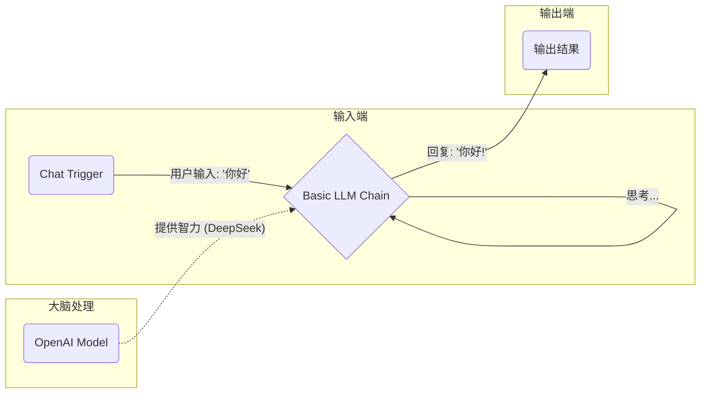

# n8n AI Workflow 核心原理与实战指南

> **导读**：n8n 不仅仅是一个连接器，它是你的 **"AI 数字员工工厂"**。在这里，你通过拖拽节点来定义员工的职责（Trigger）、大脑（Model）和手脚（Action）。

## 1. 核心原理拆解：我们在做什么？

你正在构建一个 **AI 驱动的数据流水线**。每一个 Workflow 都是一个独立的自动化程序。

### 1.1 三大核心要素

| 元素 | 形象比喻 | 功能 | 例子 |
| :--- | :--- | :--- | :--- |
| **Trigger (触发器)** | **发令枪** | 告诉流程何时开始 | 收到邮件时、每天早上9点、收到Webhook请求时 |
| **Node (节点)** | **工人/机器** | 处理数据、执行动作 | AI 思考、读取数据库、发送邮件、转换格式 |
| **Connection (连线)** | **传送带** | 把上一步的结果传给下一步 | 连线上的小圆点流动的就是 Data (JSON格式) |

### 1.2 你的当前工作流图解

你正在搭建一个 **"基础 AI 对话机器人"**。

1.  **监听**: `Chat Trigger` 像一个接线员，一直等着用户说话。
2.  **传输**: 一旦用户说了“你好”，它就把这两个字打包成 JSON，通过连线传给 `Basic LLM Chain`。
3.  **思考**: `Basic LLM Chain` 收到数据。它自己不会思考，于是它调用挂载在它身上的 `OpenAI Model` (实际上是 OneAPI/DeepSeek)。
4.  **返回**: DeepSeek 算好答案，传回给 Chain，Chain 再把答案显示出来。

---

## 2. 界面元素详解

当你打开 n8n 画布时，你需要关注以下几点：

### 2.1 节点结构
*   **左边的小圆点 (Input)**: 数据入口。
*   **右边的小圆点 (Output)**: 数据出口。
*   **下边/上边的插槽 (Parameters)**: 这种特殊的连接点（如 `Model`, `Memory`）不是传数据的，而是**插配件**的。就像给电脑插上显卡一样。

### 2.2 关键参数 (Basic LLM Chain)
*   **Prompt**: 这里是指令的核心。
    *   **Define below**: 直接在框里写死（适合测试）。
    *   **Connected User Message**: 自动使用 Trigger 传过来的用户消息（适合生产环境）。
*   **Model**: 必须连接。没有 Model 的 Chain 就像没有 CPU 的电脑。

---

## 3. 五大真实商业场景 (由浅入深)

掌握这些场景，你就能理解为什么要学 n8n，以及它如何变现。

### 场景一：智能客服 (Smart Support Bot)
*   **难度**: ⭐
*   **原理**: 你的当前工作流 + 知识库。
*   **价值**: 7x24小时自动回复常见问题，节省人力。
*   **流程**: `Chat Trigger` -> `AI Agent` (挂载 `Vector Store` 知识库) -> `Output`。

### 场景二：AI 日报/周报生成器 (Auto Report)
*   **难度**: ⭐⭐
*   **原理**: 定时任务 + 读取数据 + AI 总结 + 发送。
*   **价值**: 解放双手，不再写烦人的周报。
*   **流程**:
    1. `Schedule Trigger` (每周五 17:00)
    2. `Notion/Jira` (读取本周完成的任务)
    3. `Basic LLM Chain` (Prompt: "请把这些零碎的任务整理成一份专业的周报，包含本周进展、下周计划...")
    4. `Gmail/Slack` (发送给老板)

### 场景三：销售线索清洗与评分 (Lead Scoring)
*   **难度**: ⭐⭐⭐
*   **原理**: 接收表单 -> AI 分析意向 -> 分流处理。
*   **价值**: 帮销售团队过滤掉无效咨询，只跟进大客户。
*   **流程**:
    1. `Webhook` (接收官网咨询表单)
    2. `Basic LLM Chain` (Prompt: "分析这个客户的留言。如果他是想买产品的，打分80-100；如果是推销广告的，打分0。只输出分数。")
    3. `If` (分数 > 80 ?)
    4. **True**: `CRM` (录入系统) + `Slack` (通知销售主管: "大鱼来了!")
    5. **False**: `End` (直接忽略)

### 场景四：竞品情报监控系统 (Competitor Watch)
*   **难度**: ⭐⭐⭐⭐
*   **原理**: 自动抓取网页 -> AI 提炼 -> 预警。
*   **价值**: 实时掌握市场动向，无需人工盯着对手网站。
*   **流程**:
    1. `Schedule` (每小时)
    2. `HTTP Request` (抓取对手博客 RSS 或 网页 HTML)
    3. `HTML Extract` (提取正文)
    4. `Basic LLM Chain` (Prompt: "这篇文章讲了什么新功能？对我们有威胁吗？用一句话总结。")
    5. `Microsoft Teams/Lark` (发送情报卡片)

### 场景五：自动化 SEO 内容矩阵 (Auto Content Machine)
*   **难度**: ⭐⭐⭐⭐⭐
*   **原理**: 关键词 -> AI 写大纲 -> AI 写正文 -> AI 配图 -> 自动发布。
*   **价值**: 批量生产高质量 SEO 文章，获取海量流量。
*   **流程**:
    1. `Google Sheets` (读取今日关键词: "如何做番茄炒蛋")
    2. `Basic LLM Chain 1` (生成大纲)
    3. `Basic LLM Chain 2` (根据大纲写正文)
    4. `OpenAI Image` (根据内容生成配图)
    5. `Wordpress` (发布文章)

---

## 4. 你的下一步行动

1.  **跑通基础**: 按照之前的指导，手动在这个 Chain 里输入文字，看它能不能回复。
2.  **理解变量**: 尝试用 `Chat Trigger`，看看数据是怎么从左边流到右边的。
3.  **连接外部**: 试着把 Output 的结果，不再只是显示，而是发送给自己的一封邮件 (增加一个 Gmail 节点)。
